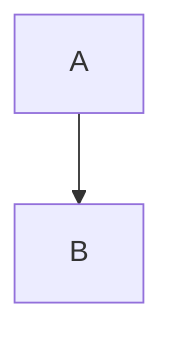
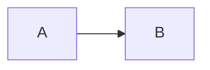
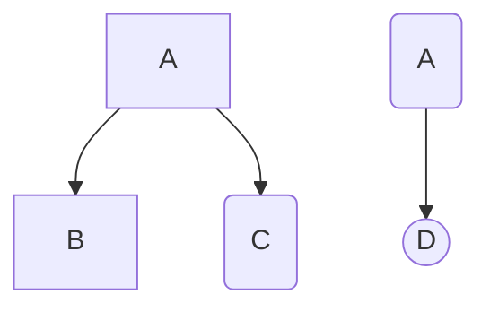
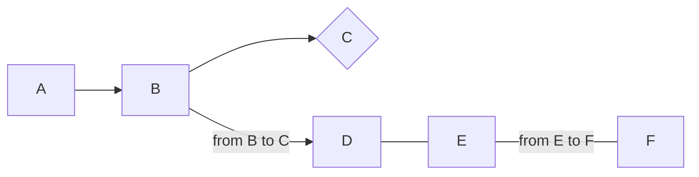

## 마크다운 문법정리

## 개요
> 내가 보기위한 마크다운 `Markdown` 작성법  

* toc
{:toc}


## 마크다운이란?
---
Markdown은 텍스트 기반의 마크업언어로 2004년 존그루버에 의해 만들어졌으며 쉽게 쓰고 읽을 수 있으며 HTML로 변환이 가능하다. 특수기호와 문자를 이용한 매우 간단한 구조의 문법을 사용하여 웹에서도 보다 빠르게 컨텐츠를 작성하고 보다 직관적으로 인식할 수 있다. 마크다운이 최근 각광받기 시작한 이유는 깃헙(https://github.com) 덕분이다. 깃헙의 저장소Repository에 관한 정보를 기록하는 README.md는 깃헙을 사용하는 사람이라면 누구나 가장 먼저 접하게 되는 마크다운 문서였다. 마크다운을 통해서 설치방법, 소스코드 설명, 이슈 등을 간단하게 기록하고 가독성을 높일 수 있다는 강점이 부각되면서 점점 여러 곳으로 퍼져가게 된다.

***

## 마크다운의 장단점
---
### 2.1.장점
    '''
    1. 간결하다.
    2. 별도의 도구없이 작성가능하다.
    3. 다양한 형태로 변환이 가능하다.
    4. 텍스트(Text)로 저장되기 때문에 용량이 적어 보관이 용이하다.
    5. 텍스트파일이기 때문에 버전관리시스템을 이용하여 변경이력을 관리할 수 있다.
    6. 지원하는 프로그램과 플랫폼이 다양하다.
    '''

### 2.2.단점
    '''
    1. 표준이 없다.
    2. 표준이 없기 때문에 도구에 따라서 변환방식이나 생성물이 다르다.
    3. 모든 HTML 마크업을 대신하지 못한다.
    '''

***

## 마크다운 문법
---
지금 위에서 설명한것만으로 벌써 마크다운의 문법을 사용하였다.
사용한것부터 시작하여 마크다운 문법을 봐보자.

## 1 코드블럭
---

위에서 장단점을 설명할때와 같이 회색 박스

4가지 방식을 사용할 수 있다.

(1. ```<pre><code> {code} </code></pre>```)

(2. <code>```</code> 또는 <code>~~~</code> )

(3. 들여쓰기)

(4. 언어별 코드블럭)


 #### 1.1. ```<pre><code>{code}</code></pre>``` 이용방식

```
<pre>
<code>
def func(a,b):
    return a+b
print(func(2,3))
</code>
</pre>
```
 🔍 **결과**

<pre>
<code>
def func(a,b):
    return a+b

print(func(2,3))
</code>
</pre>
---
#### 1.2. 코드블럭코드(<code>```</code> 또는 <code>~~~</code>) 을 이용하는 방법

<pre>
<code>
```
def func(a,b):
    return a+b

print(func(2,3))
```
</code>
</pre>

 🔍 **결과**

```
def func(a,b):
    return a+b

print(func(2,3))
```
---
#### 1.3. 들여쓰기

탭이나 스페이스 4번을 통해 코드블럭을 만들수 있다.

<pre>
<code>
    def func(a,b):
        return a+b

    print(func(2,3))
</code>
</pre>

 🔍 **결과**

    def func(a,b):
        return a+b

    print(func(2,3))

---

#### 1.4. 언어별 코드블럭

__python__

<pre>
<code>

~~~python
  def func(a,b):
      return a+b

  print(func(2,3))
~~~

</code>
</pre>

 🔍 **결과**
 ~~~python
   def func(a,b):
       return a+b

   print(func(2,3))
 ~~~


 __css__

<pre>
<code>
~~~css
.tipue_search_icon
{
	 width: 19px;
	 height: 19px;
	 margin-bottom: 0rem;
	 background-color: #626591;
}
.tipue_search_left
{
	 float: left;
	 padding: 10px 5px 0 0;
	 color: #e3e3e3;
	 max-height: 20px;
}
~~~
</code>
</pre>


 🔍 **결과**

~~~css
.tipue_search_icon
{
	width: 19px;
	height: 19px;
	margin-bottom: 0rem;
	background-color: #626591;
	}
.tipue_search_left
{
	 float: left;
	 padding: 10px 5px 0 0;
	 color: #e3e3e3;
	 max-height: 20px;
}
~~~


* 그밖에

    * Bash (bash)
    * C# (cs)
    * CSS (css)
    * Diff (diff)
    * HTML, XML (html)
    * Ini (ini)
    * JSON (json)
    * Java (java)
    * JavaScript (javascript)
    * PHP (php)
    * Perl (perl)
    * Python (python)
    * Ruby (ruby)
    * SQL (sql)

***

## mermaid

mermaid 패키지는 mermaid라는 그래프 시각화 라이브러리를 지원합니다.

jekyll에는 게시물과 페이지에서 인어 다이어그램과 순서도를 간단하게 만들 수 있는 _plugins(플러그인) 이 있습니다. 그러나 안전상의 이유로 github에서 자동으로 게시물을 웹 페이지로 변환하려면 플러그인을 사용할 수 없습니다.

따라서 JavaScript code를 직접 다운로드 하는 방법을 사용해야합니다. mermaid git에 ==dist== 디렉토리에 ==mermaid.min.js==파일을 다운로드 합니다.

다운로드 한 파일을 jekyll 프로젝트의 js 또는 _js 폴더에 넣습니다. 저의 경우 _js/src 폴더에 mermaid.min.js파일을 넣었습니다.

_includes 디렉토리에 head.html에 아래 코드를 추가해줍니다.


<pre>
<code>
\`\`\`mermaid!
graph TD
  A --> B;
\`\`\`

\`\`\`mermaid!
graph LR
  A --> B;
\`\`\`
</code>
</pre>

\` 사이에 \\는 지워주세요.

<br>





<br>

블럭 내에서 <code>graph 방향</code>으로 그래프 방향을 명시할 수 있습니다.

+ <code>TB</code> 또는 <code>TD</code>의 경우 위에서 아래로 이어줍니다.
+ <code>BT</code>의 경우 아래에서 위로 이어줍니다.
+ <code>LR</code> 의 경우 왼쪽에서 오른쪽으로 이어줍니다.
+ <code>RL</code> 의 경우 오른쪽에서 왼쪽으로 이어줍니다.

<code>--></code>로 노드끼리 이을 수 있습니다.

~~~
\`\`\`mermaid!
graph TD
  A --> B;
  A --> node03(C)
  node04(A) --> node05((D))
\`\`\`

\`\`\`mermaid!
graph LR
  A --> B;
  B --> id03{C}
  B -- from B to C -->
  D --- E
  E -- from E to F --- F
\`\`\`

\`\`\`mermaid!
graph TD;
    A-->B;
    A-->C;
    B-->D;
    C-->D;
\`\`\`
~~~







~~~mermaid
graph TD;
    A-->B;
    A-->C;
    B-->D;
    C-->D;
~~~


+ 한번 사용한 노드는 이후에도 변수명처럼 재활용할 수 있습니다.

  + 이 경우 동일한 문구를 출력하는 또 다른 노드를 만들 수 없습니다.
  + 이를 해결하기 위해 노드의 ID값과 출력값을 구분하는 문법을 사용합니다.
  + <code>ID값 + 출력값</code>의 문법으로 노드를 정의하면 이 문제를 해결할 수 있습니다.

+ 출력값을 감싸는 괄호의 종류에 따라 노드의 무양이 결정됩니다.

  + <code>[]</code> --> 각진 네모
  + <code>()</code> --> 둥근 네모
  + <code>{}</code> --> 마름모
  + <code>(())</code> --> 원

+ <code>--[문장]--></code>으로 노드를 잇는 간선에 문장을 삽입할수 있습니다.

+ 노드간 <code>---</code>로 이을 경우 화살표가 없는 간선으로 노드를 이을 수 있습니다.

  + 이 경우 <code>--[문장]--</code>으로 간선에 문장을 출력할 수 있습니다.

## 2 헤더
---
* 글머리: 1~6까지만 지원

<pre>
<code>
# this is a H1
## this is a H2
### this is a H3
#### this is a H4
##### this is a H5
###### this is a H6
</code>
</pre>

 🔍 **결과**

# this is a H1
## this is a H2
### this is a H3
#### this is a H4
##### this is a H5
###### this is a H6

***

## 3 BlockQuote
---
인용문
이메일에서 사용하는 '''>''' 블록인용문자를 이용한다.

✏️
<pre>
<code>
> This is a first blockque.
</code>
</pre>

> This is a first blockque.

✏️

<pre>
<code>
>   > This is a second blockque.
</code>
</pre>

>   > This is a second blockque.

✏️
<pre>
<code>
>   >   > This is a Third blockque.
</code>
</pre>

>   >   > This is a Third blockque.

✏️
BlockQuote 안에 다른 마크다운 요소를 포함할 수 있다.

<pre>
<code>
> ### This is a H3
> * List
>	```
>	code
>	```
</code>
</pre>

 🔍 **결과**

> ### This is a H3
> * List
>	```
>	code
>	```

---
## 4 글머리 기호
---

~~~
+ 글머리
  + 글머리2
    + 글머리3
      + 글머리 4
~~~

 🔍 **결과**

+ 글머리
  + 글머리2
    + 글머리3
      + 글머리 4

---
## 5 강조
---

~~~
*single asterisks*  
_single underscores_  
**double asterisks**  
__double underscores__  
~~cancelline~~  
~~~

 🔍 **결과**

*single asterisks*  
_single underscores_  
**double asterisks**  
__double underscores__  
~~cancelline~~  

---

## 6 기호표시

### Markdown에서 이미 사용되는 기호, 표기하기

Markdown 문법에 사용되는 기호를 있는 그대로 표시하고 싶을 경우가 있다. 예를 들어 # 마크를 그냥 쓰면 H1 제목으로 출력된다.
또 <code>t.max(dim=0)\[0]</code>를 있는 그대로 쓰면 <code>t.max(dim=0)[0]</code>게 된다.

~~~
\   backslash
*   asterisk
_   underscore
{}  curly braces
[]  square brackets
()  parentheses
#   hash mark
+   plus sign
-   minus sign (hyphen)
.   dot
!   exclamation mark
~~~

위 기호들을 있는 그대로 쓰고 싶다면 기호 앞에 \\(=back slash) 문자를 써주면 된다. \\(back slash)를 그대로 쓰고 싶다면 \\\를 2개 쓰면 된다.

---

## 7 수평
---

<pre>
<code>
* * *

***

*****

---

- - -
</code>
</pre>

 🔍 **결과**

* * *

***

*****

---

- - -

<br>

---
## 8 링크
---
+ 외부 링크

~~~
[link 키워드](링크 주소)

예 : [내 블로그](https://khw11044.github.io/about.html)
~~~


 🔍 **결과**

예 : [내 블로그](https://khw11044.github.io/about.html)


+ 자동 링크

~~~
<주소>

예 : <https://khw11044.github.io/about.html>
~~~

 🔍 **결과**

예 : <https://khw11044.github.io/about.html>


---
## 9 이미지
---
이미지 크기 조절은 ```</img>```
또는 ```{: width="" height=""}```

~~~

{: width="400" height="400"}

@import "/assets/img/etc/markdownshow.jpg"

~~~

 🔍 **결과**


{: width="400" height="400"}


---
## 10 줄바꿈
---

1. ```<br>``` 사용
~~~
줄 바꿈시 사용 <br>
줄 바꿈시 사용
~~~

 🔍 **결과**

 줄바꿈시 사용 <br>
 줄바꿈시 사용

<br>

2. Enter 2번 사용

~~~
줄 바꿈시 사용  


줄 바꿈시 사용
~~~

 🔍 **결과**

줄 바꿈시 사용  


줄 바꿈시 사용

---
## 11 표
---

~~~

| ------ | NumPy | PyTorch |
| ------ | -------- | ---------- |
| 선언 | np.array() | torch.FloatTensor, <br/> torch.Tensor()|
| 차원 확인 | .ndim | .dim()|
| 크기 확인 | .shape | .size()|
~~~

 🔍 **결과**

| ------ | NumPy | PyTorch |
| ------ | -------- | ---------- |
| 선언 | np.array() | torch.FloatTensor, <br/> torch.Tensor()|
| 차원 확인 | .ndim | .dim()|
| 크기 확인 | .shape | .size()|

> 🖍 Tip: 한 행에서 Ctrl 누르고 위,아래 화살표를 누르면 그 행을 위아래로 이동시킬수 있다.
---

## 12 Expander control
---
마크다운에서 접기/펼치기 가능한 컨트롤 문법  
마크다운 자체에는 기능이 없고 html을 이용

> html의 details 사용

~~~html
<details>
<summary>접기/펼치기 버튼</summary>
<div markdown="1">

|제목|내용|
|--|--|
|1|1|
|2|10|

</div>
</details>
~~~

 🔍 **결과**

 <details>
 <summary>접기/펼치기 버튼</summary>
 <div markdown="1">

 |제목|내용|
 |--|--|
 |1|1|
 |2|10|

 </div>
 </details>


<details>
<blockquote>
askdmasldsaldsal;das;dsa;dksal;dkas;ldka;
aasdasldlasdkladklasdklas;dkasldas;ld
asdkaslaskldjakd
</blockquote>
</details>

---


## 13 유튜브영상 넣기
---

_includes\youtubePlayer.html 파일을 만든다.

~~~
<style>
    .embed-container { position: relative; padding-bottom: 56.25%; height: 0; overflow: hidden; max-width: 100%; } 
    .embed-container iframe, 
    .embed-container object, 
    .embed-container embed { position: absolute; top: 0; left: 0; width: 100%; height: 100%; }
</style>

<div class="embed-container" >
    <iframe src="https://www.youtube.com/embed/{{ include.id }}" frameborder="0" allowfullscreen="" onclick="ga('send', 'event', 'post', 'click', 'youtubePlayer');">
    </iframe>
</div>
~~~

위 코드를 넣어준다.

원하는 위치에 아래 코드를 삽입한다.

~~~
\{\% include youtubePlayer.html id="ah9MZQ0PjMI" \%\}
~~~

```plantuml!
Bob -> Alice : hello world
```


 🔍 **결과**




하지만 Jekyll-Spaceship만 깔면 위과정을 할필요없다.

~~~


~~~


---

## 14 이모지
---

1. Window 키 + ;

2. 복붙
🔗 [http://www.iemoji.com/](http://www.iemoji.com/)
📝✏️✒️💡 🧰 🙋🏻‍♂️

---

## 15 수학수식
---

Lorem ipsum $$ f(x) = x^2 $$.

$f(x) = x^2$

---
## 16 형광펜,강조, 버튼효과
---
형광펜 밑줄, 강조, 버튼

~~~
<kbd>hello</kbd>

==hello==

<a>hello</a>

<code>hello</code>

<mark>hello</mark>

<under>hello</under>

~~~

 🔍 **결과**

<kbd>hello</kbd>

==hello==

<a>hello</a>

<code>hello</code>

<mark>hello</mark>  

<under>hello</under>
---
## Reference
---
+ [ihoneymon 님의 마크다운 ](https://gist.github.com/ihoneymon/652be052a0727ad59601)
