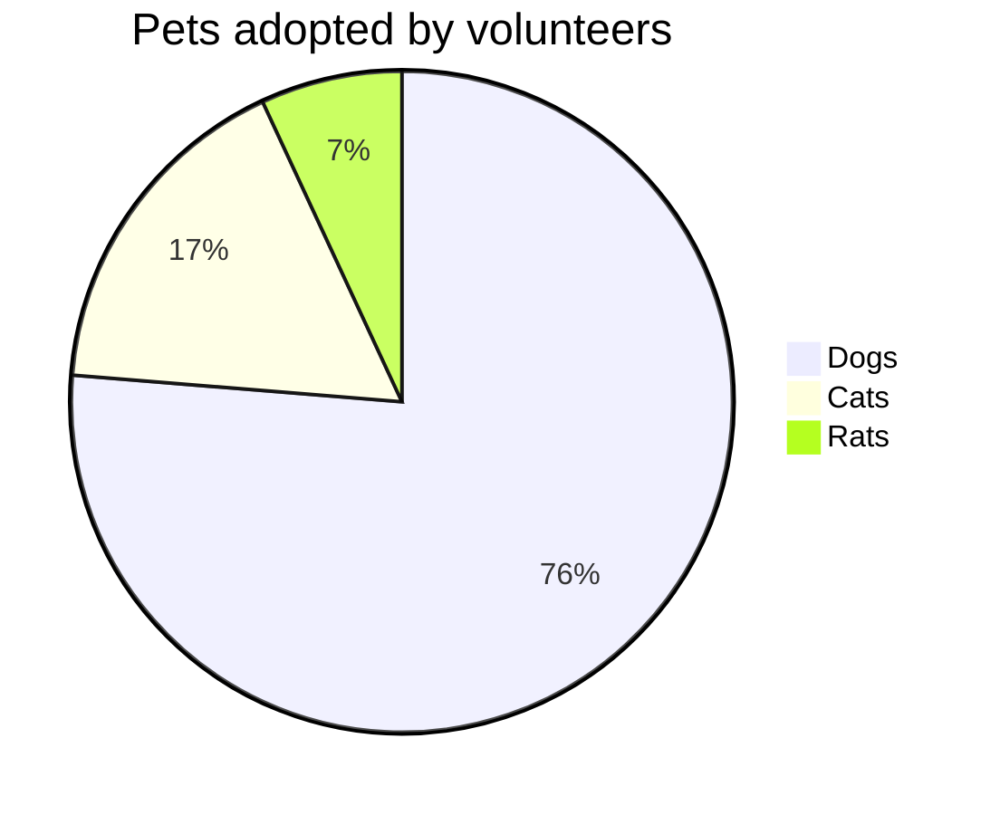
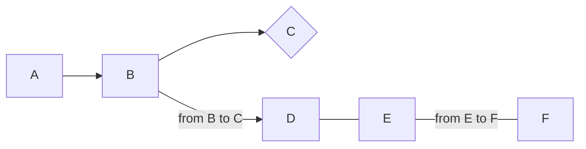

# jekyll 블로그 포스팅을 위한 세팅

* toc
{:toc}

# 개요
---
지금까지 깃헙 블로그를 하면서 수많은 어려움을 만났었는데요... ㅠㅠ  
지킬 **수학수식** 넣는 방법을 찾기위해 몇일을 밤을 새며 찾아보고 (js파일을 다운받고 html을 만들고 불러오고 붙혀넣고, gem로 어떻게 하고... 그래도 안되고..)  
지킬 **mermaid** 넣는 방법 찾기위해 수일을 쓰고..  
지킬 **유튜브 영상**넣는 방법도 따로 뭐 만들고 넣고 불러오고...

참 많은 고생을 했는데요...

이제 그럴필요 없습니다.

킹 갓 제네럴 **지킬 플러그인**을 소개 시켜드릴려고 합니다.

지킬, github 블로그, github pages에 수학수식, mermaid, 유튜브 영상 모든지 이 Plugin이면 끝입니다.

## Jekyll Spaceship!!!

[Jekyll Spaceship!!!](https://github.com/jeffreytse/jekyll-spaceship)

위 링크를 알아냈습니다.... 😂

방법은

#### 1. Gemfile 파일에 아래 코드 넣기
~~~
gem 'jekyll-spaceship'
~~~

#### 2. _config.yml파일의 plugins에 아래 코드 넣기
~~~
plugins:
  - jekyll-spaceship
~~~

#### 3. 원하는 효과 필요없는 효과 골라서 넣기

저는 아래 코드를 다 넣었습니다.
수학 수식을 위한 mathjax와 mermaid, media(유튜브등) 등등 많은 효과를 쉽게 쓰기위해 다 추가합니다.
~~~
# Where things are
jekyll-spaceship:
  # default enabled processors
  processors:
    - table-processor
    - mathjax-processor
    - plantuml-processor
    - mermaid-processor
    - polyfill-processor
    - media-processor
    - emoji-processor
    - element-processor
  mathjax-processor:
    src:
      - https://polyfill.io/v3/polyfill.min.js?features=es6
      - https://cdn.jsdelivr.net/npm/mathjax@3/es5/tex-mml-chtml.js
    config:
      tex:
        inlineMath:
          - ['$','$']
          - ['\(','\)']
        displayMath:
          - ['$$','$$']
          - ['\[','\]']
      svg:
        fontCache: 'global'
    optimize: # optimization on building stage to check and add mathjax scripts
      enabled: true # value `false` for adding to all pages
      include: []   # include patterns for math expressions checking (regexp)
      exclude: []   # exclude patterns for math expressions checking (regexp)
  plantuml-processor:
    mode: default  # mode value 'pre-fetch' for fetching image at building stage
    css:
      class: plantuml
    syntax:
      code: 'plantuml!'
      custom: ['@startuml', '@enduml']
    src: http://www.plantuml.com/plantuml/svg/
  mermaid-processor:
    mode: default  # mode value 'pre-fetch' for fetching image at building stage
    css:
      class: mermaid
    syntax:
      code: 'mermaid!'
      custom: ['@startmermaid', '@endmermaid']
    config:
      theme: default
    src: https://mermaid.ink/svg/
  media-processor:
    default:
      id: 'media-{id}'
      class: 'media'
      width: '100%'
      height: 350
      frameborder: 0
      style: 'max-width: 600px; outline: none;'
      allow: 'encrypted-media; picture-in-picture'
  emoji-processor:
    css:
      class: emoji
    src: https://github.githubassets.com/images/icons/emoji/
~~~

## 사용법

### 수학 수식 : MathJax

~~~
$ a * b = c ^ b $

$ 2^{\frac{n-1}{3}} $

$ \int\_a^b f(x)\,dx. $
~~~

$ a * b = c ^ b $

$ 2^{\frac{n-1}{3}} $

$ \int\_a^b f(x)\,dx. $

hydejack 테마의 경우 inline(\$한개만)이 안먹혔는데 이제는 된다. ^^

### mermaid

~~~
\`\`\`mermaid!
pie title Pets adopted by volunteers
  "Dogs" : 386
  "Cats" : 85
  "Rats" : 35
\`\`\`
~~~
\\는 빼주세요

~~~
\`\`\`mermaid!
graph LR
  A --> B;
  B --> id03{C}
  B -- from B to C -->
  D --- E
  E -- from E to F --- F
\`\`\`
~~~

> [mermaid 자세한 사용법](https://mermaid-js.github.io/mermaid/#/)

### Media (유튜브등)

Inline-style :
~~~

~~~

Reference-style:
~~~
![][{reference}]

[{reference}]: {media-link}
~~~

**Youtube Usage**

~~~

~~~

## 자세한 사용법, Reference

[Jekyll Spaceship!!!](https://github.com/jeffreytse/jekyll-spaceship)

+ 깃헙 레파지토리에 올리고 url로 확인해보니 하나도 적용이 안되어있네.... 로컬에서만 잘 작동되는 것이었다...

이렇게 써져있기는 한데...

누가 대신 해결해줬으면 좋겠네요..

 

💡**도움말** : GitHub 페이지는 safe모드 에서 실행되며 [허용 된 플러그인 집합](https://pages.github.com/versions/) 만 허용 합니다 . GitHub 페이지에서 gem을 사용하려면 로컬에서 빌드하거나 CI (예 : [travis](https://travis-ci.org/) , [github workflow](https://docs.github.com/en/actions/learn-github-actions) )를 사용하고 gh-pages브랜치에 배포해야합니다 .

무제한 GitHub 페이지에 대한 추가 사항
다음은 Jekyll 사이트 배포를위한 [jekyll-deploy-action](https://github.com/jeffreytse/jekyll-deploy-action) 이라는 GitHub 작업 입니다.👍
다음은 Travis를 사용하여 참조를 위해 GitHub 페이지를 구축하고 배포 하는 [Jekyll 사이트](https://github.com/jeffreytse/jekyll-jeffreytse-blog) 입니다.

아...또 몇시간했는데 해결 못했다...ㅠ
